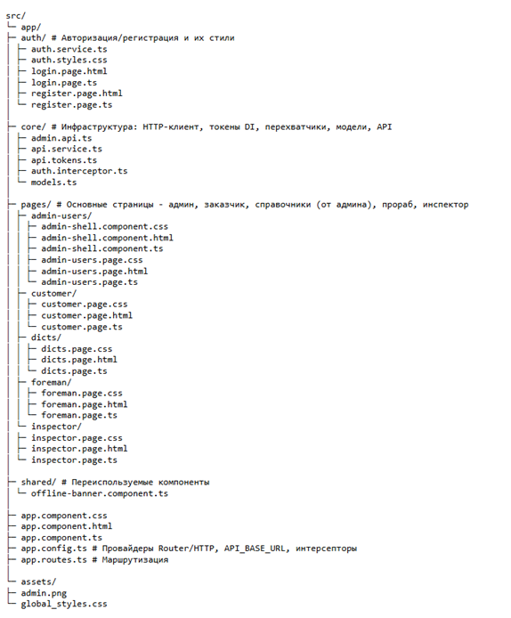

# Frontend Structure (Angular)

## Дерево проекта

---

### `auth/` — авторизация
- **auth.service.ts** — работа с бэком: `login()/register()/logout()`, хранение токена в `localStorage`, поток `user$`.
- **auth.styles.css** — общий вид карточек и полей для страниц логина/регистрации.
- **login.page.* / register.page.*** — страницы входа и регистрации (верстка + валидация).

### `core/` — инфраструктура
- **api.tokens.ts** — DI-токен `API_BASE_URL` (базовый адрес бэкенда).
- **api.service.ts** — `HttpClient` (методы `get/post/put/patch/delete`, сборка URL).
- **auth.interceptor.ts** — HTTP-перехватчик: добавляет `Authorization: Bearer <token>` ко всем запросам.
- **admin.api.ts** — фичи для админки (пример): `listUsers()/createUser()/blockUser()` и интерфейсы данных.
- **models.ts** — место для общих типов домена (заготовка).

### `pages/` — экранные модули
- **admin-users/**
  - `admin-shell.component.*` — оболочка админки (шапка, левое меню, «Выход», `<router-outlet>` для внутренних страниц).
  - `admin-users.page.*` — таблица пользователей, панель создания, загрузка данных через `AdminApi`.
- **customer/** — страница клиента/заказчика: три колонки (Объекты / Прорабы / Карта), индикатор онлайн/офлайн.
- **foreman/** — страница прораба: три колонки (Объекты / Уведомления / Карта).
- **inspector/** — страница инспектора: структура как у клиента.
- **dicts/** — экран «Справочники» (карточки «Виды работ», «Типы замечаний»).

### `shared/`
- **offline-banner.component.ts** — «Вы оффлайн».

### Корневые файлы приложения
- **app.routes.ts** — маршруты 
- **app.config.ts** — DI-конфигурация приложения:  
  `provideRouter(routes)`, `provideHttpClient()` с `auth.interceptor.ts`, провайдер `API_BASE_URL`.
- **app.component.*`** — корневой компонент (`<router-outlet>`).
- **assets/** — картинки и глобальные стили.
